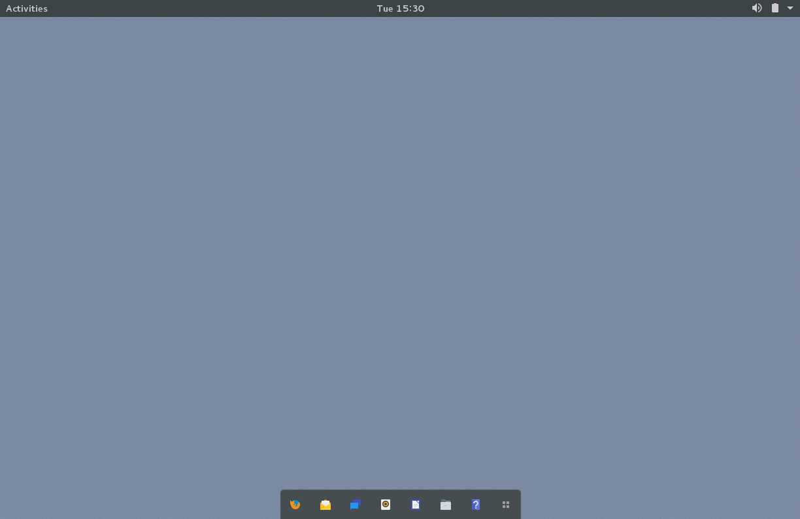
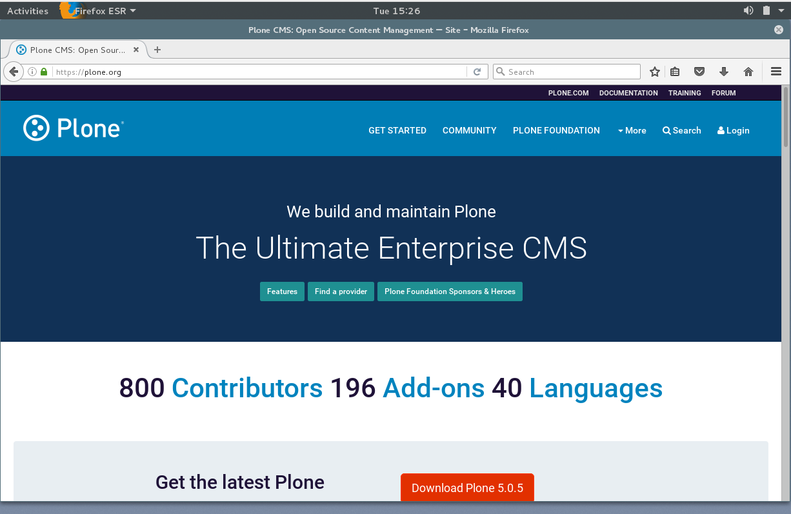
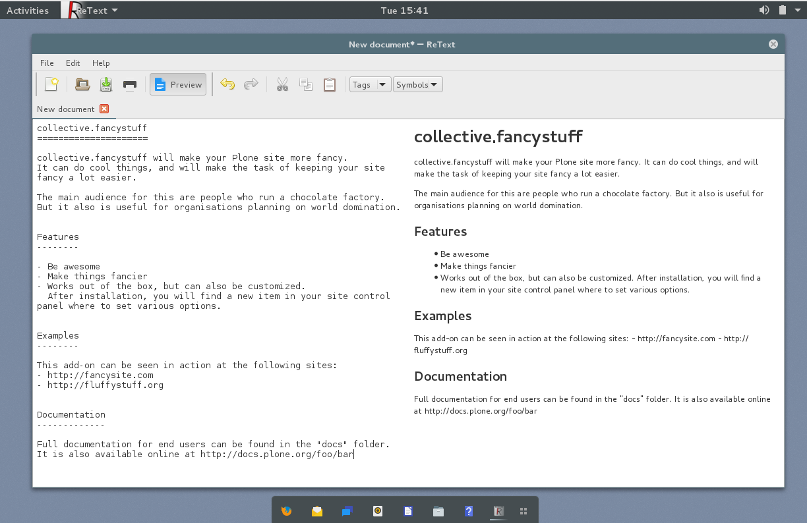

===================
Desktop environment
===================

mr.otlet uses `Gnome3 <https://www.gnome.org/>`_ as desktop environment.

The `Paper Project <https://snwh.org/paper>`_ theme and icons are used.

Desktop
=======

A open Firefox
==============

A open ReText
=============

Vim
===

Vim editing python:

.. image:: _static/vim _python.png
   :alt: Picture of vim editing python

Vim editing reStructuredText [rst]

.. image:: _static/vim _rst.png
   :alt: Picture of vim editing reStructuredText
