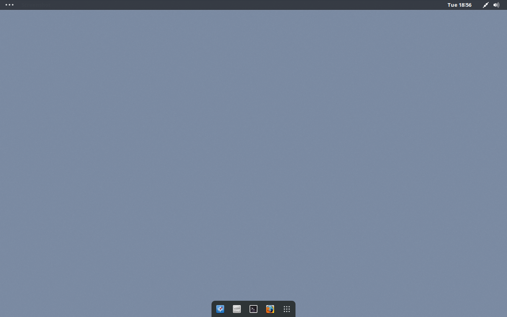
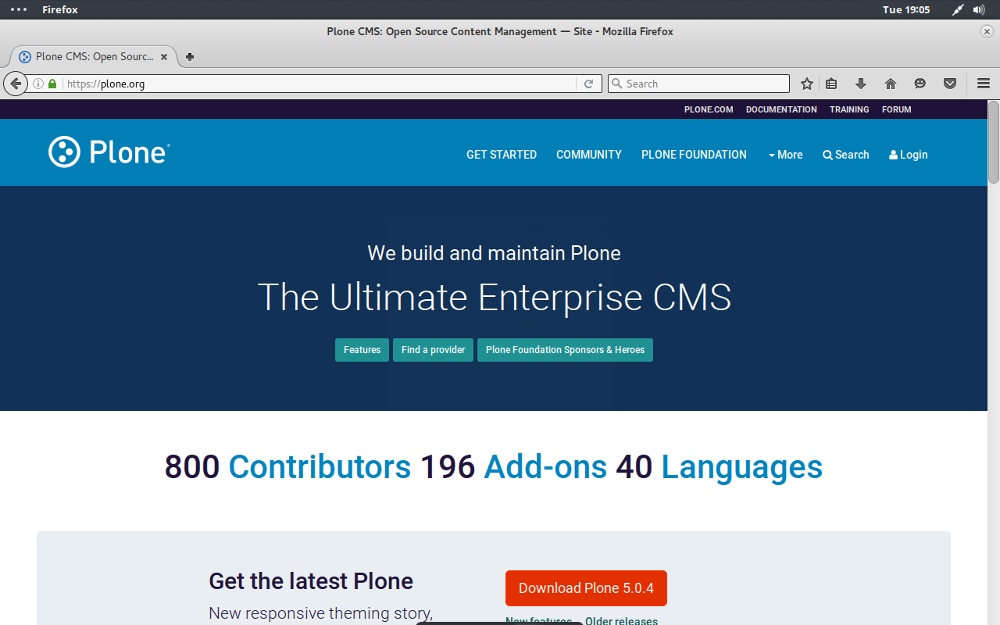
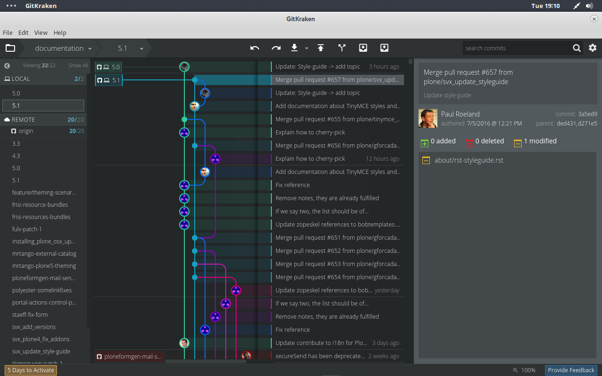

===================
Desktop environment
===================

mr.otlet uses `Gnome3 <https://www.gnome.org/>`_ as desktop environment.

As theme for GTK and gnome-shell, `Zukitwo <https://github.com/lassekongo83/zuki-themes>`_ is used with the `Faenza Dark Icon Theme <https://www.gnome-look.org/content/show.php/Faenza+Dark+Icons+(edited)?content=132327>`_.

